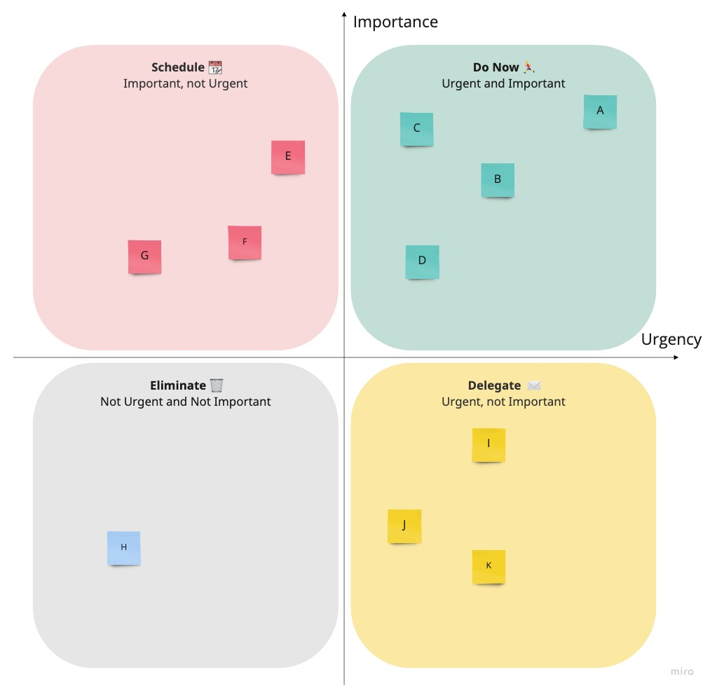
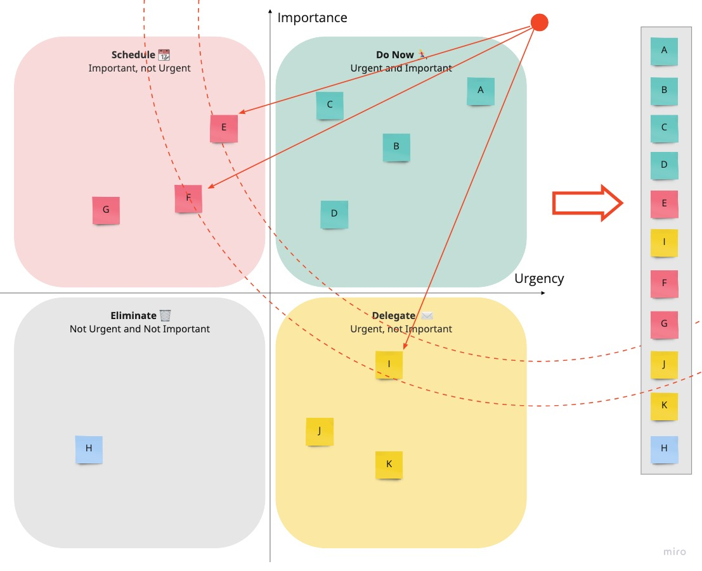

# Help Me Decide It!

This application helps you decide which tasks to prioritize, based on [Eisenhower's Matrix](https://todoist.com/productivity-methods/eisenhower-matrix).

## Using relative comparisons to come up with a general priority

A **Task** is one thing that we want to prioritize. In the diagram above, they would be the post-id cards.

To distribute the tasks on the quadrants, we must assign two values to them: their **Importance** and **Urgency**.

Since it's sometimes hard to assign these values independently, we will do a system in which we compare tasks two by two. For example, given a task `A` and task `B`, we will pick which one is the most important, and the most urgent (it may be the same task, or maybe one is more important but the other is more urgent).

Once these comparisons are done, which task will have an overall value of importance and urgency, which will allow us to place them in the quadrants as we see on the diagram.

## Generating a task list from the priority values

Having the tasks placed on the quadrant, we will use a distance function to transform a 2D diagram into a sorted list of tasks, which can be assigned to a backlog etc.

That is achieved by measuring the Euclidian distance of each task to the point of maximum urgency and importance (red dot on the diagram). Note in the diagram that by measuring these distances, we
came up with the task order of `E`, then `I`, then `F`

